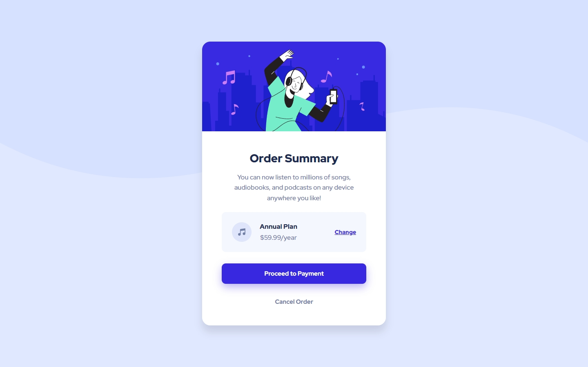

## Frontend Mentor Challenge 04 - Order Summary Component

This is a solution to the [Order summary card challenge on Frontend Mentor](https://www.frontendmentor.io/challenges/order-summary-component-QlPmajDUj). Frontend Mentor challenges help you improve your coding skills by building realistic projects. 

### Screenshots of my solution

#

### Links
- Live Site URL: 
- Solution URL: 
#

### Built with
- HTML5 / CSS
- CSS Flexbox
- CSS Grid
#

### New things I learned
- Mobile first approach
#

- My Frontend Mentor Profile - [@DarkstarXDD](https://www.frontendmentor.io/profile/DarkstarXDD)
